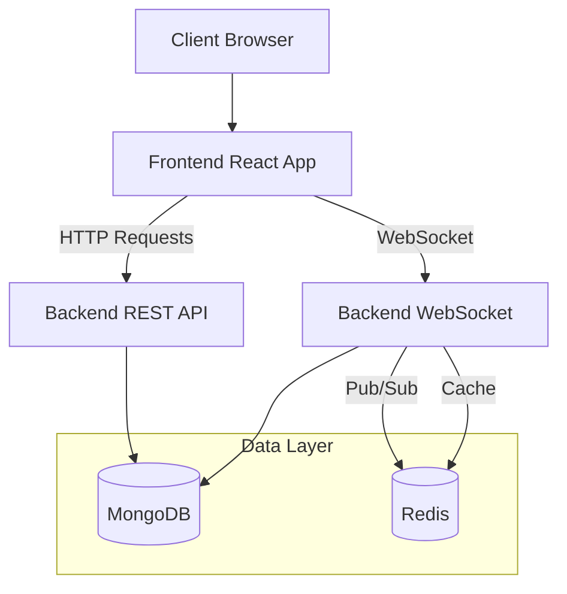
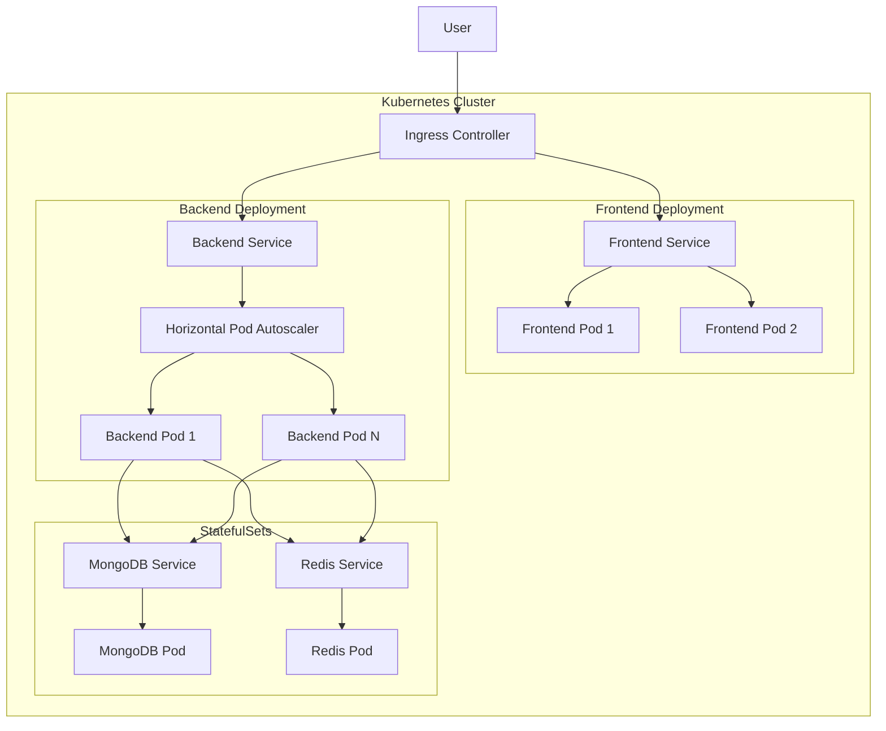
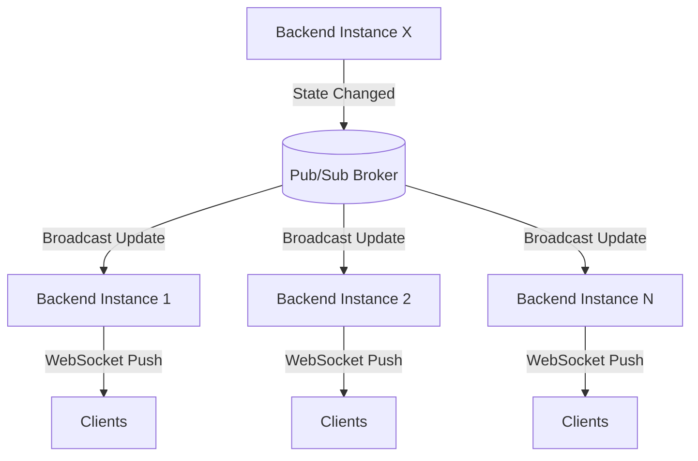
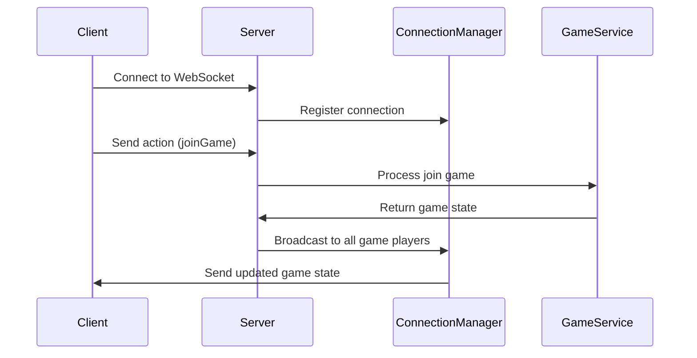
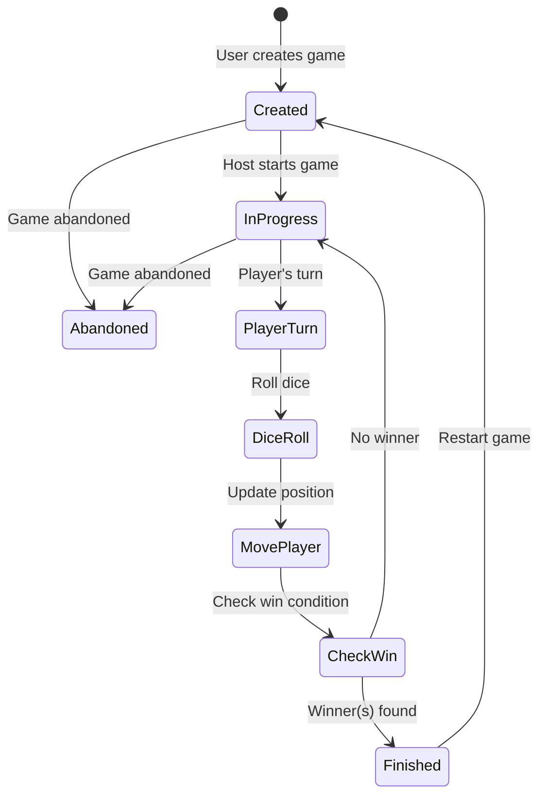

# Snakes and Ladders Game

### Try it out [https://snake-and-ladders-ten.vercel.app/](https://snake-and-ladders-ten.vercel.app/login)

# Contents
- [Overview](#overview)
- [Features](#features)
- [Architecture](#architecture)
- [Frontend](#frontend)
- [Backend](#backend)
- [Game Flow](#game-flow)
- [Deployment](#deployment)
- [Development Setup](#development-setup)
- [Contributing](#contributing)

# Overview

Modern multiplayer Snakes & Ladders game with real-time gameplay, in-game chat, secure authentication, and scalable architecture. Players can create games, join existing matches, and interact live.

# Features

- **Real-time Multiplayer**: Play with friends or strangers in real-time using WebSockets.
- **In-Game Chat**: Chat with other players in the game lobby.
- **Secure Authentication**: Google OAuth integration for secure and easy login.
- **Game State Management**: Robust game state handling with optimistic locking to prevent race conditions.
- **Scalable Architecture**: Built with Microservices and Kubernetes in mind, utilizing Redis for Pub/Sub and caching.

# Architecture

### System Architecture
The application is built on a client–server architecture, where a React-based frontend communicates with a Go backend using RESTful APIs for standard requests and WebSockets for real-time, bidirectional interactions.

MongoDB serves as the primary persistent data store, optimized for high write throughput. It is used to rapidly persist game data, ensuring low-latency, durable storage during gameplay. Redis is employed as an in-memory data layer to cache active game state and to implement Pub/Sub messaging, enabling efficient broadcasting of game state updates across multiple backend server instances.

This architecture supports horizontal scalability, real-time synchronization, and fault tolerance, while maintaining low latency for both reads and writes.



### Kubernetes Architecture
The system is designed for horizontal scalability, with both frontend and backend services able to scale independently based on traffic patterns. Backend scaling is driven dynamically, allowing the platform to handle spikes in concurrent game sessions without manual intervention.

Fault tolerance is achieved through service-level load balancing and redundant backend instances. If a pod or node fails, traffic is automatically redistributed to healthy replicas, ensuring uninterrupted gameplay and consistent client connectivity.

For low-latency real-time interactions, Redis plays a central role by caching active game state and using Pub/Sub to broadcast updates across backend instances. This ensures all connected clients receive timely and consistent game state updates regardless of which server instance they are connected to, while MongoDB provides durable persistence without impacting real-time performance.



# Frontend
The frontend is developed with React and TypeScript, ensuring a robust, type-safe, and modern development experience. It leverages Vite for lightning-fast development and optimized production builds. The game board is rendered using HTML5 Canvas, while WebSockets enable real-time communication with the backend. The implementation follows industry best practices, featuring proactive error handling and reconnection strategies to deliver a seamless and resilient user experience.

**Technology Stack**
- **Framework:** React with TypeScript
- **Build Tool:** Vite
- **State Management:** React Context API
- **UI Components:** Shadcn

# Backend
The backend is built with Go, offering exceptional performance and concurrency for real-time gameplay. It runs two dedicated HTTP servers—one serving the RESTful API and another handling WebSocket connections. The REST API manages user authentication, as well as the creation and retrieval of past games, while real-time gameplay, dice rolls, and in-game chat are seamlessly facilitated through WebSockets.

MongoDB is used for data persistence, providing scalability, flexibility, and high availability. The backend efficiently leverages goroutines to enable concurrent handling of multiple game sessions and player interactions, ensuring a smooth experience even under heavy load.

The backend utilizes Redis for two critical functions:
1. **Optimistic Locking:** To handle concurrent game updates safely. The `WATCH` command monitors game keys, and updates are applied using `MULTI/EXEC` transactions only if the key hasn't changed since it was watched. This prevents race conditions when multiple actions are performed simultaneously.
2. **Pub/Sub Messaging:** For broadcasting game state updates. When a game state changes, the updated state is published to a channel, and all server instances subscribed to that channel broadcast the update to connected clients via WebSockets.



For authentication, the system employs JWT with RSA signing, integrating Google OAuth for secure and streamlined user login.

The application follows a multi-layered architecture—comprising transport, service, model, repository, controller, and handler layers—to ensure clear separation of concerns and maintainability. The design adheres to sound system design principles and SOLID best practices, promoting clean, modular, and testable code.

**Technology Stack**
- **Language:** Go
- **Web Framework:** Gorilla Mux for routing
- **WebSockets:** Gorilla WebSocket
- **Database:** MongoDB with official Go driver
- **Caching & Pub/Sub:** Redis
- **Authentication:** JWT with RSA signing

### REST API Endpoints

| Method | Endpoint | Description                 |
| ------ | -------- | --------------------------- |
| `GET`  | `/auth`  | Google OAuth login          |
| `GET`  | `/user`  | Get authenticated user info |
| `POST` | `/game`  | Create a new game           |
| `GET`  | `/games` | Get past games              |

### WebSocket API



| Action | Description                 |
| ------ | --------------------------- |
| `joinGame`  | Join a game                 |
| `startGame` | Start a game                |
| `nextTurn`  | Next player's turn          |
| `chatMessage` | Send a chat message         |
| `restartGame` | Starts a new game          |


# Game Flow



# Deployment

### Prerequisites
- Kubernetes cluster
- kubectl configured
- Ingress controller set up

### Deployment Steps

```bash
# From project root
./deploy.sh
```

This script:
- Builds frontend and backend Docker images
- Pushes images to the kind cluster
- Applies Kubernetes manifests to create the following resources:
  - Namespace
  - ConfigMaps and Secrets
  - Deployments and Services for
    1. MongoDB
    2. Redis
    3. Backend
    4. Frontend
  - Ingress for routing and external access

# Development Setup

### Prerequisites
- Google Cloud Project with OAuth credentials configured for localhost.
- MongoDB instance running locally or accessible remotely.
- Redis instance running locally or accessible remotely.

Clone the repository and follow the steps below to set up the development environment.

## Backend Setup
1. Create a `.env` file in the `backend` directory from the provided `.env.template` and fill in the required environment variables.

2. Generate RSA keys for JWT authentication:
```bash
cd backend/keys
openssl genrsa -out private.pem 2048
openssl rsa -in private.pem -pubout -out public.pem
```

3. Start the application
```bash
cd backend
go mod download
go run main.go
```

## Frontend Setup

1. Create a `.env` file in the `frontend` directory from the provided `.env.template` and fill in the required environment variables.

2. Start the application
```bash
cd frontend
pnpm install
pnpm run dev
```

4. **Access the application**
- Frontend: http://localhost:5000
- Backend REST API: http://localhost:8081
- Backend WebSocket: ws://localhost:9999

# Contributing
We love contributions! Feel free to create a pull request 🌱