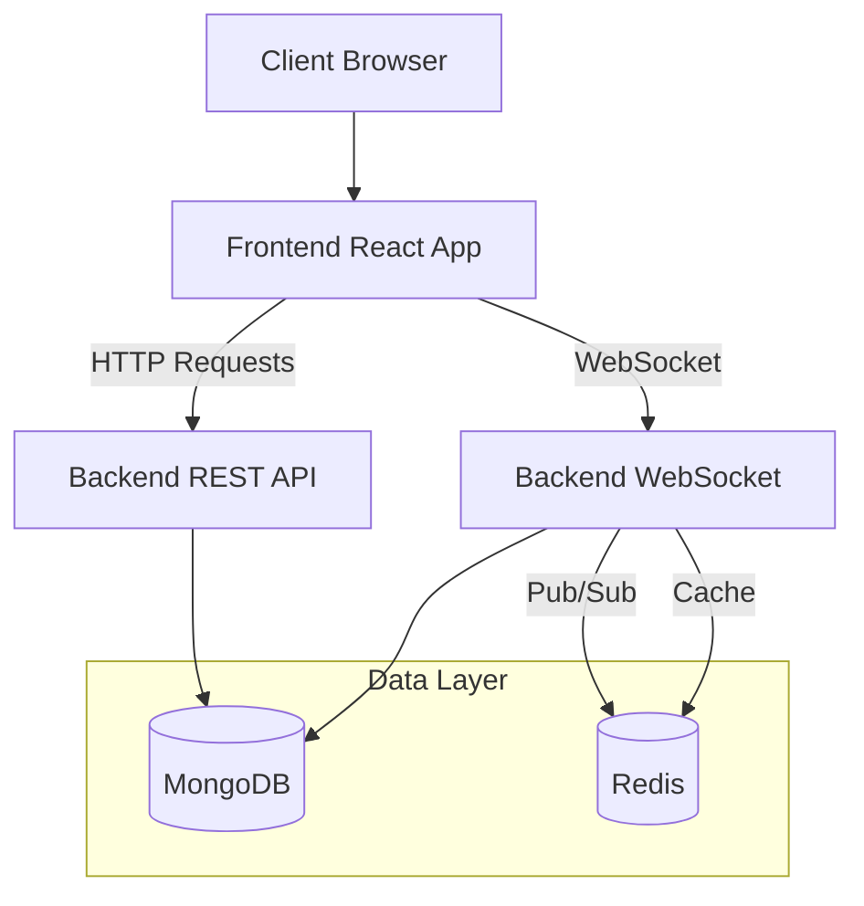
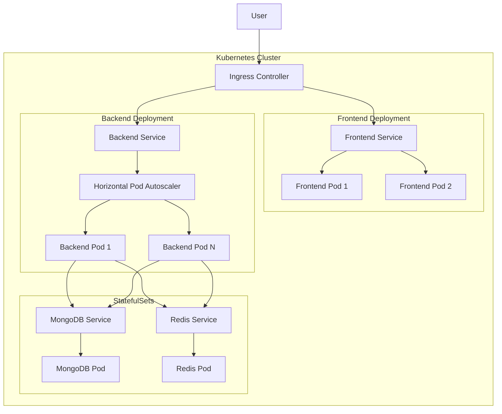
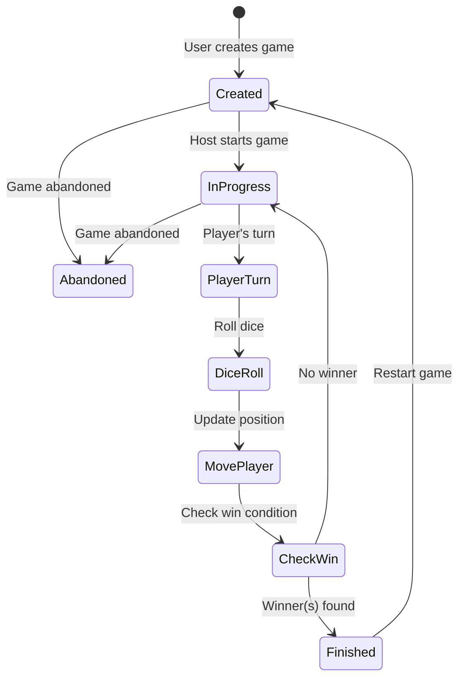

# Snakes and Ladders Game

### Try it out [https://snake-and-ladders-ten.vercel.app/](https://snake-and-ladders-ten.vercel.app/)

## Table of Contents
- [Overview](#overview)
- [Features](#features)
- [Architecture](#architecture)
  - [System Architecture](#system-architecture)
  - [Kubernetes Architecture](#kubernetes-architecture)
- [Frontend](#frontend)
- [Backend](#backend)
- [Game Flow](#game-flow)
- [Deployment](#deployment)
- [Development Setup](#development-setup)
- [Contributing](#contributing)

## Overview

This is a modern multiplayer Snakes and Ladders game with real-time gameplay. Players can create games, join existing games and chat with other players.

## Features

- **Real-time Multiplayer**: Play with friends or strangers in real-time using WebSockets.
- **In-Game Chat**: Chat with other players in the game lobby.
- **Secure Authentication**: Google OAuth integration for secure and easy login.
- **Game State Management**: Robust game state handling with optimistic locking to prevent race conditions.
- **Scalable Architecture**: Built with Microservices and Kubernetes in mind, utilizing Redis for Pub/Sub and caching.

## Architecture

### System Architecture



### Kubernetes Architecture



The Kubernetes architecture deploys the application using:
- **Ingress:** Manages external access to services
- **Deployments:** For frontend and backend with multiple replicas
- **Services:** Expose frontend and backend pods
- **StatefulSet:** Manages MongoDB for persistent data storage
- **Horizontal Pod Autoscalers (HPA):** Automatically scales pods based on CPU usage
- **ConfigMaps/Secrets:** Store configuration and sensitive data

## Frontend
The frontend is developed with React and TypeScript, ensuring a robust, type-safe, and modern development experience. It leverages Vite for lightning-fast development and optimized production builds. The game board is rendered using HTML5 Canvas, while WebSockets enable real-time communication with the backend. The implementation follows industry best practices, featuring proactive error handling and reconnection strategies to deliver a seamless and resilient user experience.

### Technology Stack
- **Framework:** React with TypeScript
- **Build Tool:** Vite
- **State Management:** React Context API
- **UI Components:** Shadcn

## Backend
The backend is built with Go, offering exceptional performance and concurrency for real-time gameplay. It runs two dedicated HTTP servers—one serving the RESTful API and another handling WebSocket connections. The REST API manages user authentication, as well as the creation and retrieval of past games, while real-time gameplay, dice rolls, and in-game chat are seamlessly facilitated through WebSockets.

MongoDB is used for data persistence, providing scalability, flexibility, and high availability. The backend efficiently leverages goroutines to enable concurrent handling of multiple game sessions and player interactions, ensuring a smooth experience even under heavy load.

For authentication, the system employs JWT with RSA signing, integrating Google OAuth for secure and streamlined user login.

The application follows a multi-layered architecture—comprising transport, service, model, repository, controller, and handler layers—to ensure clear separation of concerns and maintainability. The design adheres to sound system design principles and SOLID best practices, promoting clean, modular, and testable code.

### Connect concurrency & Real-time updates
The backend utilizes Redis for two critical functions:
1. **Optimistic Locking:** To handle concurrent game updates safely. The `WATCH` command monitors game keys, and updates are applied using `MULTI/EXEC` transactions only if the key hasn't changed since it was watched. This prevents race conditions when multiple actions are performed simultaneously.
2. **Pub/Sub Messaging:** For broadcasting game state updates. When a game state changes, the updated state is published to a channel, and all server instances subscribed to that channel broadcast the update to connected clients via WebSockets.

### Technology Stack
- **Language:** Go
- **Web Framework:** Gorilla Mux for routing
- **WebSockets:** Gorilla WebSocket
- **Database:** MongoDB with official Go driver
- **Caching & Pub/Sub:** Redis
- **Authentication:** JWT with RSA signing

### API Endpoints

**REST API**
| Method | Endpoint | Description                 |
| ------ | -------- | --------------------------- |
| `GET`  | `/auth`  | Google OAuth login          |
| `GET`  | `/user`  | Get authenticated user info |
| `POST` | `/game`  | Create a new game           |
| `GET`  | `/games` | Get past games              |

**WebSocket API**: Endpoint: `/game`

| Action | Description                 |
| ------ | --------------------------- |
| `joinGame`  | Join a game                 |
| `startGame` | Start a game                |
| `nextTurn`  | Next player's turn          |
| `chatMessage` | Send a chat message         |
| `restartGame` | Starts a new game          |

## Game Flow



## Deployment

### Prerequisites
- Kubernetes cluster
- kubectl configured
- Ingress controller set up

### Deployment Steps

1. Build and push Docker images:
```bash
# From project root
./deploy.sh
```

This script:
- Starts a local Docker registry in the cluster for securely managing images
- Builds frontend and backend Docker images
- Pushes images to the local docker registry
- Applies Kubernetes manifests:
  - namespace.yml
  - secrets.yml
  - mongo/statefulset.yml, service.yml
  - redis/deployment.yml, service.yml
  - backend/deployment.yml, service.yml, hpa.yml
  - frontend/deployment.yml, service.yml
  - ingress.yml

## Development Setup

### Prerequisites
- Google Cloud Project with OAuth credentials configured for localhost.
- MongoDB instance running locally or accessible remotely.
- Redis instance running locally or accessible remotely.

Clone the repository and follow the steps below to set up the development environment.

### Backend Setup
1. Create a `.env` file in the `backend` directory from the provided `.env.template` and fill in the required environment variables.

2. Generate RSA keys for JWT authentication:
```bash
cd backend/keys
openssl genrsa -out private.pem 2048
openssl rsa -in private.pem -pubout -out public.pem
```

3. Start the application
```bash
cd backend
go mod download
go run main.go
```

### Frontend Setup

1. Create a `.env` file in the `frontend` directory from the provided `.env.template` and fill in the required environment variables.

2. Start the application
```bash
cd frontend
pnpm install
pnpm run dev
```

4. **Access the application**
- Frontend: http://localhost:5000
- Backend REST API: http://localhost:8081
- Backend WebSocket: ws://localhost:9999

# Contributing
We love contributions! Feel free to create a pull request 🌱